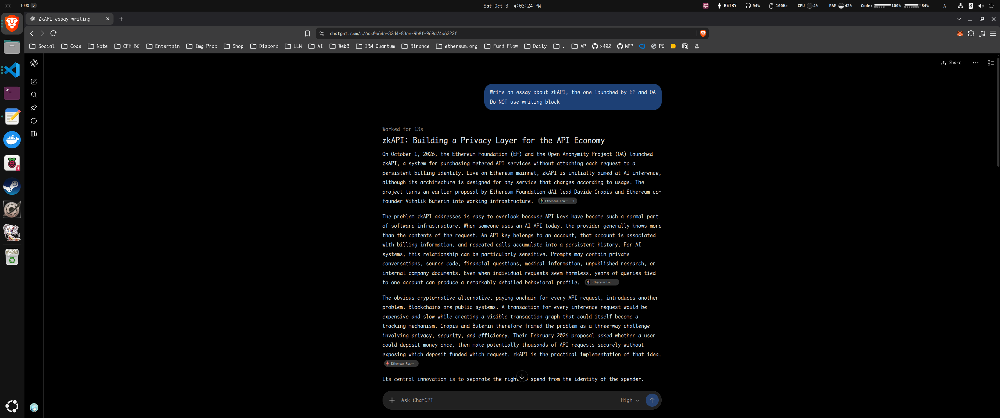
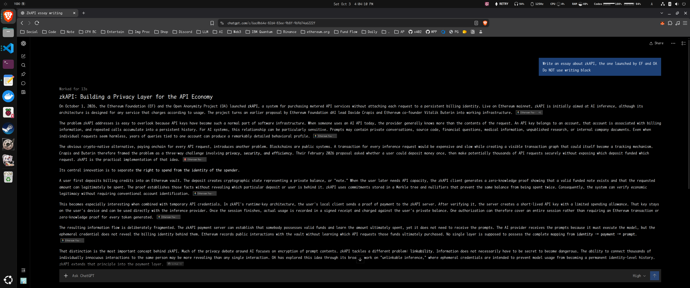
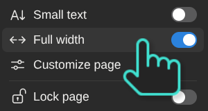
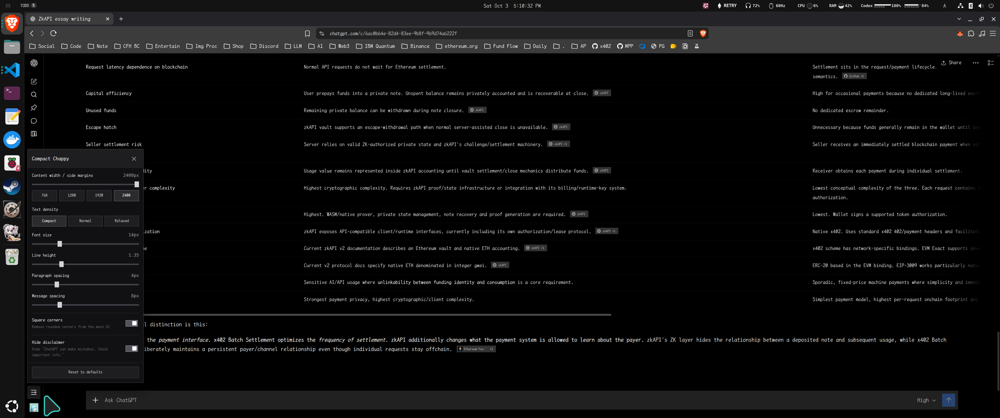

# Compact Chappy

A small browser extension that makes the ChatGPT web UI wider, denser, and more configurable.

## Why

I don't like narrow centered max-width content columns because, as you can see in the screenshots, the text is in the middle and both sides have so much spare space.

### Original layout

### Compact Chappy layout

Why waste the space? I don't understand. Maybe it's more comfortable for most people? Most frontier AI models, including ChatGPT, Claude, Gemini, Grok, Meta AI, Microsoft Copilot, and DeepSeek, use this kind of layout in their chat frontends. But I like all the information to be displayed on the screen. I hate lines being wrapped, and I have to keep scrolling, which is really annoying.

Especially since I'm using a widescreen monitor (Acer Nitro ED343CUR J0bmiippx, 3440 × 1440), the original layout is absolutely unacceptable to me.

Notion does have an option to disable its narrow centered max-width content column (the "Full width" option), while ChatGPT doesn't.

That's why I made this extension.

## Features

- Adjustable content width and text density
- Square-corner mode
- Optional hiding of the "ChatGPT can make mistakes" notice

## How to use?

1. [Download the extension here](https://github.com/Xeift/compact-chappy/archive/refs/heads/main.zip), then unzip it.
2. Open `chrome://extensions` or `brave://extensions`, enable **Developer mode**, choose **Load unpacked**, then select this folder.
3. Refresh the ChatGPT page. In the bottom-left corner, above your profile picture, you'll see a new icon. Click it to adjust the layout. Pretty simple.

Tested on Ubuntu 26.04.1 LTS with Brave 1.95.101. Feel free to [open an issue](https://github.com/Xeift/compact-chappy/issues/new) if you find any bugs.

## Disclaimer

This is an independent open-source project and is not affiliated with or endorsed by OpenAI.
